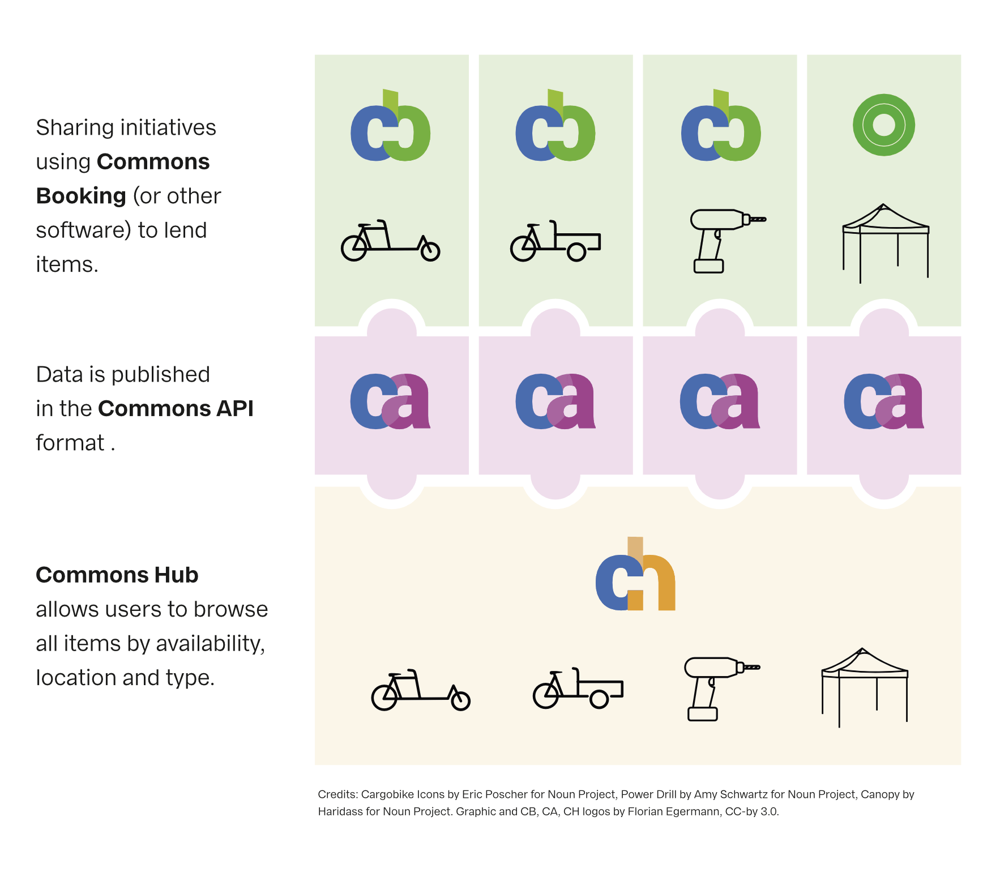

# Commons API

API for retrieving item information, availability and location of common good item(s), defined as a [JSON schema](http://json-schema.org/).



This project aims to create a standard format for exchanging information between software used by grassroots organisations to lend common goods. Based on this API, an open source "Commons Hub" software package is in development. The "Commons Hub" allows users to browse the items that all participating initiatives are offering.

By design, the API will not be collecting/sharing any user data, individual projects will remain in total control.

The Commons Api uses the [GeoJson](http://geojson.org/) format for locations. Each location is a GeoJson feature with a GeoJson point containing its coordinates. Locations are stored in GeoJson FeatureCollection.

## Example

```json
{
  "project": {
    "name": "V",
    "url": "http://localhost/",
    "description": "Just another WordPress site",
    "language": "en_US"
  },
  "items": [
    {
      "uid": "1",
      "name": "Cargo Bike Blue",
      "url": "http://localhost/item/cargo-bike-blue/",
      "owner_uid": "1",
      "availability": [
        {
          "status": "available",
          "start": "2019-01-24T08:00:00",
          "end": "2019-01-24T08:00:00",
          "location_uid": "4"
        },
        {
          "status": "booked",
          "start": "2019-01-25T08:00:00",
          "end": "2019-01-25T08:00:00",
          "location_uid": "4"
        }
      ],
      "description": "My favorite bike."
    }
  ],
  "owners": {
    "1": { "name": "admin", "url": "http://localhost/author/admin/" }
  },
  "locations": {
    "type": "FeatureCollection",
    "features": [
      {
        "type": "Feature",
        "geometry": {
          "type": "Point",
          "coordinates": [123456, 123456]
        },
        "properties": {
          "uid": "4",
          "name": "Berlin biscuits",
          "url": "http://localhost/location/berlin-biscuits/"
        }
      },
      {
        "type": "Feature",
        "geometry": {
          "type": "Point",
          "coordinates": [123456, 123456]
        },
        "properties": {
          "uid": "3",
          "name": "Budapest fairest",
          "url": "http://localhost/location/budapest-fairest/"
        }
      }
    ]
  }
}
```

## Extending the API with item metadata

The Commons Api scheme is thought of as a basis from which to start. Providers should create their own schemas that add specific metadata to the base scheme. This can be done by using "allOf" with "additionalProperties" set to false. See the [JSON schema reference on combining schemes](https://json-schema.org/understanding-json-schema/reference/combining.html) for further details.

This repository contains the [Velogistics Api](https://github.com/wielebenwir/commons-api/blob/master/velogistics-api.schema.json) for cargobikes as an example for this.

## Contributing

We are looking for contributers, both developers and sharing initiatives.

- [Join our mailing list](https://ml06.ispgateway.de/mailman/listinfo/commons-api_wielebenwir.de)

## Implementation

As a first step, we are working to implement the API into 2 projects that are already widely used to share cargo bikes:

- Booking software: [Commons Booking](https://github.com/wielebenwir/commons-booking-2) (Wordpress Plugin, used by over 60 sharing initiatives)
- Hub: [velogistics.net](http://velogistics.net) (Cargobike-sharing portal with more than 250 available bikes)

Commons Booking provides initiatives with a tool to manage and lend common goods, the successor of velogistics will serve as the hub connecting the individual installations.

## Draft

The API is defined in a [JSON schema](https://github.com/wielebenwir/commons-api/blob/master/commons-api.schema.json) in this repository. We have used schema descriptions to self-document the format. You can use the [JSON schema validator](https://www.jsonschemavalidator.net/) to try out the schema. Just paste the file content into the left field and start to compose your first Commons API data.

[TODO]: Add Example of a json return for a bike from the commons cargobike project http://kasimir-lastenrad.de.
