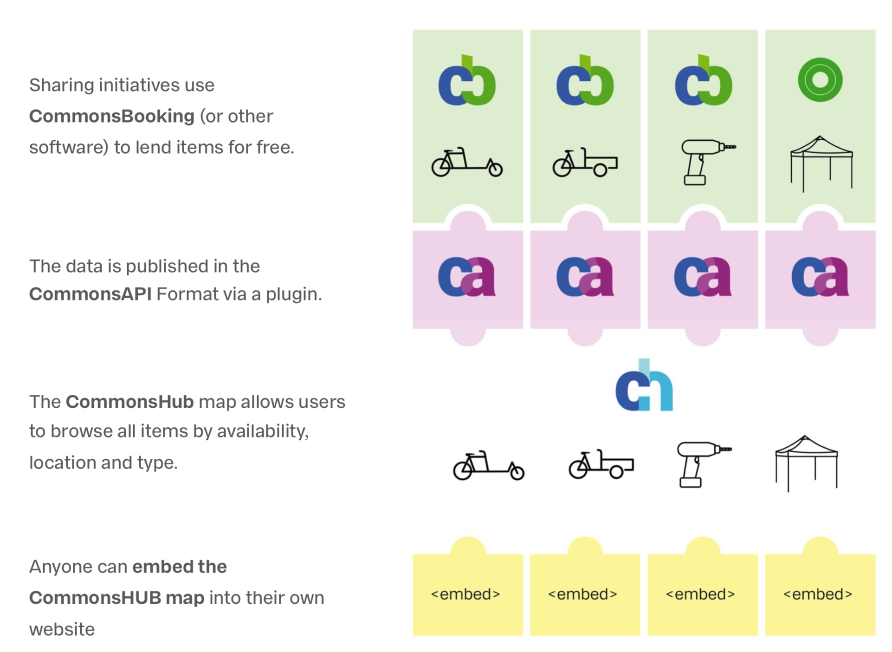

# Commons API

API for retrieving item information, availability and location of common good item(s), defined as a [JSON schema](http://json-schema.org/). Please note that this is still a work in progress and not a finished API.

This project aims to create a standard format for exchanging information between software used by grassroots organisations to lend common goods. Based on this API, an open source "Commons Hub" software package is in development. The "Commons Hub" allows users to browse the items that all participating initiatives are offering.

By design, the API will not be collecting/sharing any user data, individual projects will remain in total control.

The Commons Api uses the [GeoJson](http://geojson.org/) format for locations. Each location is a GeoJson feature with a GeoJson point containing its coordinates. Locations are stored in GeoJson FeatureCollection.

## Extending the API with item metadata

The Commons Api scheme is thought of as a basis from which to start. Providers should create their own schemas that add specific metadata to the base item scheme. This can be done by using "allOf" with "additionalProperties" set to false. See the [JSON schema reference on combining schemes](https://json-schema.org/understanding-json-schema/reference/combining.html) for further details.

This repository contains the [Velogistics Api](https://github.com/wielebenwir/commons-api/blob/master/velogistics-api.schema.json) for cargobikes as an example for this. It adds itemType, features, load capacity and box dimensions as metadata properties.

Providers or consumers of Velogistics API data can use the [velogistics-metadata.json file](https://github.com/wielebenwir/commons-api/blob/master/velogistics-metadata.json) to get lists of all item type and feature values supported by Commons Booking 2 and the Commons Hub. We are still in the process of defining this metadata for cargo bikes, so it is likely to change.

## Item Owners and Item Projects

Each item is hosted by a _project_ and owned by an _owner_. We distinguish between hosting projects and item owners because some projects (like Velogistics for example) do not own any items, but only offer other initiatives or persons to lend their items through the project's web application. For such multi-owner projects, all items will belong to the same project but to different owners.

Other projects may collect and redistribute Commons Api data of different projects (the Commons Hub). In such cases, different items will belong to different projects as well as to different owners.

## API Endpoints

To keep things simple, it is not possible to book items through the Commons API. For this reason all endpoints are for GET requests only.

Most API users will only need to use the `/items` endpoint to get all the available information at once.

### Items (`/items`)

-   JSON schema of the response
    -   [commons-api.items.schema.json](https://github.com/wielebenwir/commons-api/blob/master/commons-api.items.schema.json)

Returns a list of all bookable items.

By default this will also return all available information about

-   all item availabilities
-   all locations at which the items can be picked up/returned
-   all item owners
-   all item projects

If you are only interested in the item information, you can deactivate the additional information by setting the following query parameters to false: `/items/?availability=false&locations=false&owners=false&projects=false`

### Item (`/items/{item_id}`)

-   Parameters
    -   item_id (string) - the item's id
-   JSON schema of the response
    -   [commons-api.items.schema.json](https://github.com/wielebenwir/commons-api/blob/master/commons-api.items.schema.json)

Returns a list with one item object.

### Availabilities (`/availability`)

-   JSON schema of the response
    -   [commons-api.availability.schema.json](https://github.com/wielebenwir/commons-api/blob/master/commons-api.availability.schema.json)

Returns availability slots of all bookable items. Availability slots describe where an item is available during a time period. Note that Commons Booking 2 will only return daily slots for the next two weeks, even though an item might actually have several booking slots per day. An "available" slot in the Commons API thus only means that an item is available _at some point_ during the day and not necessarily that it is available for the whole day. If an item has no slot for a day in the next two weeks, it is not available (for example because it is booked or in repair).

### Availability (`/availability/{item_id}`)

-   Parameters
    -   item_id (string) - the item's id
-   JSON schema of the response
    -   [commons-api.availability.schema.json](https://github.com/wielebenwir/commons-api/blob/master/commons-api.availability.schema.json)

Returns availability slots of a specific item that describe a time period during which an item is available at a certain location. Note that Commons Booking 2 will only return daily slots for the next two weeks and that each slot does only means that the item is available at least for part of that day. This is done to reduce the amount of data that has to be synched by the Commons Hub.

### Locations (`/locations`)

-   JSON schema of the response
    -   [commons-api.locations.schema.json](https://github.com/wielebenwir/commons-api/blob/master/commons-api.locations.schema.json)

Returns all locations of bookable items as a FeatureCollection GeoJson object. The objects contains all locations in the "features" array.

### Location (`/locations/{location_id}`)

-   Parameters
    -   location_id (string) - the location's id
-   JSON schema of the response
    -   [commons-api.locations.schema.json](https://github.com/wielebenwir/commons-api/blob/master/commons-api.locations.schema.json)

Returns information about a specific location

### Owners (`/owners`)

-   JSON schema of the response
    -   [commons-api.owners.schema.json](https://github.com/wielebenwir/commons-api/blob/master/commons-api.owners.schema.json)

Returns all locations of bookable items.

### Owner (`/owners/{owner_id}`)

-   Parameters
    -   owner_id (string) - the owner's id
-   JSON schema of the response
    -   [commons-api.owners.schema.json](https://github.com/wielebenwir/commons-api/blob/master/commons-api.owners.schema.json)

Returns information about a specific owner

### Projects (`/projects`)

-   JSON schema of the response
    -   [commons-api.projects.schema.json](https://github.com/wielebenwir/commons-api/blob/master/commons-api.projects.schema.json)

Returns information about all projects hosting bookable items.

### Project (`/projects/{project_id}`)

-   Parameters
    -   project_id (string) - the project's id
-   JSON schema of the response
    -   [commons-api.projects.schema.json](https://github.com/wielebenwir/commons-api/blob/master/commons-api.projects.schema.json)

Returns a project object.

## Contributing

We are looking for contributers, both developers and sharing initiatives.

-   [Join our mailing list](https://ml06.ispgateway.de/mailman/listinfo/commons-api_wielebenwir.de)

## Implementation

See our presenation at FFL2019: [Datei:Florian Egermann Presentation CommonsBooking FFL2019.pdf – Forum Freie Lastenräder](http://dein-lastenrad.de/index.php?title=Datei:Florian_Egermann_Presentation_CommonsBooking_FFL2019.pdf#Beschreibung)

As a first step, we are working to implement the API into 2 projects that are already widely used to share cargo bikes:

-   Booking software: [Commons Booking](https://github.com/wielebenwir/commons-booking-2) (Wordpress Plugin, used by over 60 sharing initiatives)
-   Hub: [velogistics.net](http://velogistics.net) (Cargobike-sharing portal with more than 250 available bikes)

Commons Booking provides initiatives with a tool to manage and lend common goods, the successor of velogistics will serve as the hub connecting the individual installations.
